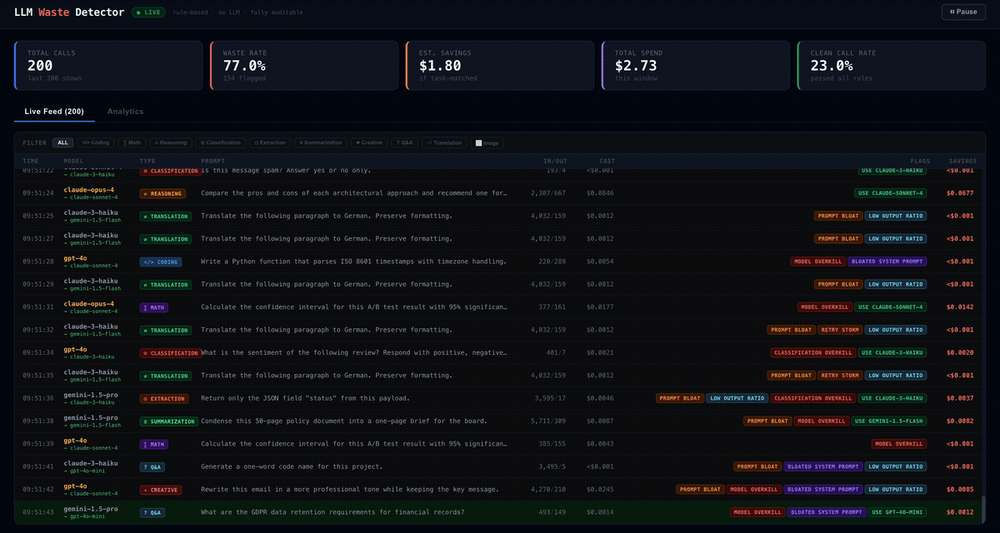

# LLM Waste Detector

A rule-based, fully auditable dashboard for detecting wasteful LLM API usage. No LLM judges the calls — pure heuristics, deterministic scoring, zero black box. Built for regulated environments where cost decisions need to be explainable.



---

## What It Does

Intercepts (or simulates) LLM API calls and runs each one through 7 rules. Flags waste in real time, estimates savings if the call had used the appropriate model, and surfaces patterns across task types, models, and services.

---

## Rules Engine

All logic lives in `src/rules.js`. Each rule is a pure function — given a call object, it returns flags. No state, no ML.

| # | Rule | Trigger | Severity |
|---|------|---------|----------|
| R1 | **Prompt Bloat** | Total input > 3k tokens with no reasoning keywords | Medium |
| R2 | **Model Overkill** | Frontier model used; no analysis/reasoning in prompt | High |
| R3 | **Retry Storm** | Same prompt (±10% tokens) fired 3+ times within 60 s | Critical |
| R4 | **Bloated System Prompt** | System prompt > 50% of total input tokens | Medium |
| R5 | **Low Output Ratio** | Completion tokens < 5% of input tokens | Low |
| R6 | **Classification Overkill** | Sentiment / yes-no / extract task on a frontier model | High |
| R7 | **Model Mismatch** | A cheaper model is known to handle this task type well | High |

### Keyword Detection

Rules R2 and R6 use keyword lists (no LLM):

- **Reasoning keywords** — `analyze`, `compare`, `evaluate`, `pros and cons`, `recommend`, `deduce`, `weigh`, etc.
- **Classification keywords** — `sentiment`, `classify`, `yes or no`, `extract the`, `label this`, `positive or negative`, etc.

### Retry Storm Detection

`attachRetryCount()` scans the last 60 seconds of history. A call is considered a retry if:
- Same model
- Prompt token count within ±10% of the new call

### Savings Estimate

For each flagged call, savings = `actual_cost − cost_if_using_recommended_model`.

Recommended model is determined by task type (see table below). Falls back to `gpt-4o-mini` for generic cases.

---

## Task Types & Recommended Models

| Task Type | Recommended Model | Reason |
|-----------|------------------|--------|
| `coding` | `claude-sonnet-4` | Sonnet handles code at ⅕ the cost of Opus |
| `math` | `claude-sonnet-4` | Sonnet-4 matches Opus on most math benchmarks |
| `reasoning` | `claude-sonnet-4` | Sonnet-4 matches Opus on reasoning; Opus for the hardest tasks only |
| `classification` | `claude-3-haiku` | Haiku/mini is purpose-built for yes-no & labels |
| `extraction` | `claude-3-haiku` | Structured extraction needs speed, not intelligence |
| `summarization` | `gemini-1.5-flash` | Flash has 1M context window, built for summarisation |
| `creative` | `claude-sonnet-4` | Creative quality equivalent to Opus at 5× less cost |
| `qa` | `gpt-4o-mini` | Factual Q&A is well-solved by mini-tier models |
| `translation` | `gemini-1.5-flash` | Translation is solved at flash tier |
| `image` | `gpt-4o` | Vision task requires a multimodal model (gpt-4o minimum) |

---

## Cost Table

Prices used for savings calculations (USD per 1k tokens):

| Model | Input | Output |
|-------|-------|--------|
| `gpt-4o` | $0.0050 | $0.0150 |
| `gpt-4o-mini` | $0.00015 | $0.0006 |
| `gpt-4-turbo` | $0.0100 | $0.0300 |
| `claude-opus-4` | $0.0150 | $0.0750 |
| `claude-sonnet-4` | $0.0030 | $0.0150 |
| `claude-3-haiku` | $0.00025 | $0.00125 |
| `gemini-1.5-pro` | $0.00125 | $0.0050 |
| `gemini-1.5-flash` | $0.000075 | $0.0003 |

---

## Project Structure

```
llm-waste-detector/
├── src/
│   ├── rules.js          # Rules engine, cost table, task type map, savings calc
│   ├── mockData.js       # Mock call generator — 28 task templates, retry burst sim
│   ├── App.jsx           # Dashboard UI — live feed, analytics, filter bar
│   ├── main.jsx          # React entry point
│   └── index.css         # Base reset + scrollbar styling
├── index.html
├── vite.config.js
└── package.json
```

---

## UI

### Live Feed Tab

Streams one call every ~1.4 s. Each row shows:

| Column | Description |
|--------|-------------|
| **Time** | HH:MM:SS |
| **Model** | Actual model used. Frontier models highlighted in amber. Recommended model shown in green below if different |
| **Type** | Task type badge (color-coded) |
| **Prompt** | Truncated prompt text |
| **In / Out** | Input tokens / completion tokens |
| **Cost** | Actual cost for this call |
| **Flags** | Rule badges. `MODEL_MISMATCH` badge shows the recommended model. Hover for reason |
| **Savings** | Estimated savings if recommended model had been used |

**Filter bar** at the top of the feed lets you filter by task type.

### Analytics Tab

Four panels:

1. **Task Types & Recommended Models** — call volume and waste per task type, with recommended model and rationale
2. **Rule Hits** — horizontal bars showing how often each rule fires and total waste attributed
3. **Spend by Model** — total cost and flagged cost per model
4. **Waste by App / Service** — which internal services are generating the most waste

---

## Getting Started

```bash
# Install
npm install

# Dev server (hot reload)
npm run dev

# Production build + preview
npm run build
npm run preview
```

Dev server: `http://localhost:5173`
Preview server: `http://localhost:4173`

---

## Call Object Schema

Every evaluated call has this shape:

```ts
{
  id:                 string      // UUID
  ts:                 number      // Unix ms timestamp
  model:              string      // e.g. "gpt-4o", "claude-sonnet-4"
  taskType:           string      // e.g. "coding", "classification"
  prompt:             string      // Full prompt text
  taskHint:           string      // Keyword hint for rule matching
  systemPromptTokens: number
  promptTokens:       number
  completionTokens:   number
  retryCount:         number      // Injected by attachRetryCount()
  app:                string      // Service name
  env:                "prod" | "staging"

  // Added by evaluate()
  flags:              Rule[]      // Triggered rules
  actualCost:         number      // USD
  savings:            number      // USD — estimated if downgraded
  recommendedModel:   string | null
}
```

---

## Connecting to a Real Proxy

The mock data layer (`src/mockData.js`) is the only part that needs replacing for production use. The rest of the pipeline is data-agnostic.

**Recommended approach:** FastAPI proxy that:
1. Intercepts all LLM API calls from your services
2. Logs each request/response with token counts
3. Streams events to this dashboard via SSE or WebSocket
4. Calls the rules engine server-side (port `rules.js` to Python or call via a Node sidecar)

Each real call maps directly to the call object schema above. Set `retryCount` using the same ±10% token window logic from `attachRetryCount()`.

---

## Extending

**Add a new rule:**

1. Add an entry to `RULES` in `rules.js`
2. Add the detection logic inside `evaluate()`
3. The badge and analytics panels pick it up automatically — no UI changes needed

**Add a new task type:**

1. Add an entry to `TASK_TYPES` (label, color, bg, emoji)
2. Add an entry to `TASK_RECOMMENDATIONS` (model, reason)
3. Add entries to `OVERKILL_RELATIVE_TO` for the recommended model
4. Use the new `taskType` key in mock tasks or real call data

**Change tick speed:**

```js
// App.jsx
const TICK_MS = 1400   // ms between simulated calls
```
